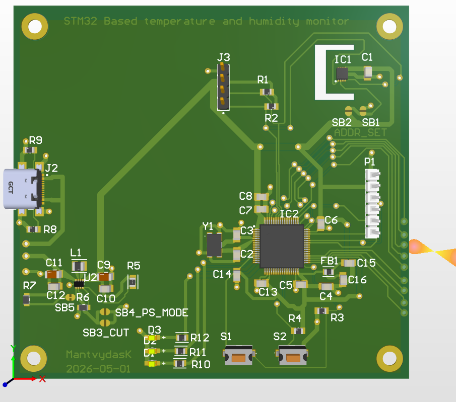
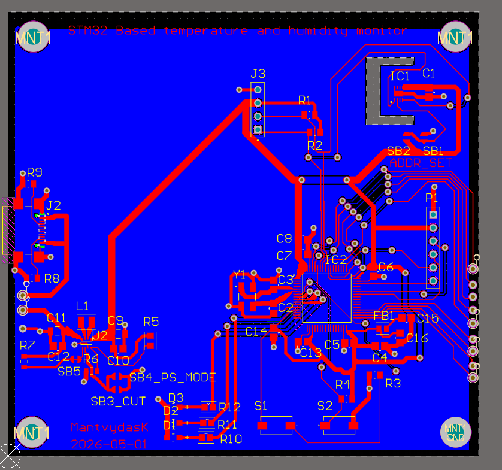
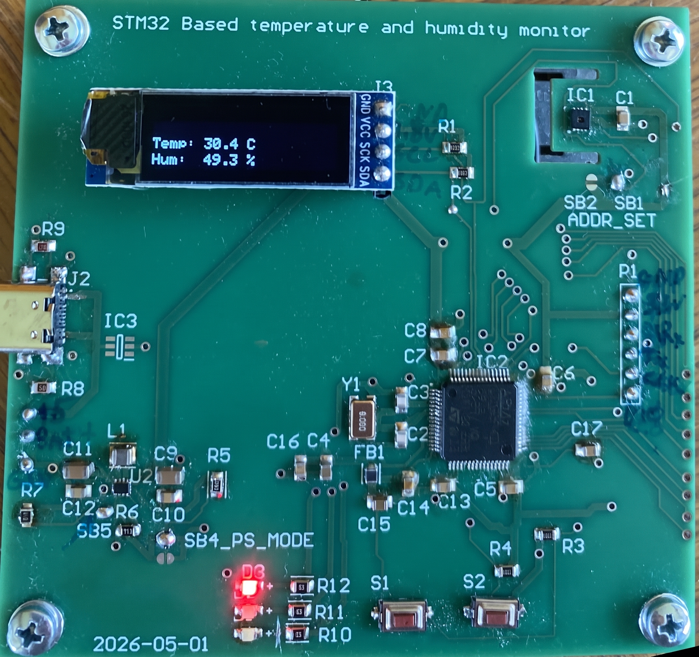

# STM Temperature and Humidity Monitor

STM32-based environmental monitor that reads temperature and humidity from an **SHT31** sensor, shows averaged values on an **SSD1306 OLED**, streams live readings over **UART**, and uses a Yakindu state machine with low-power **STOP** mode between samples.

## Features

- SHT31 temperature and humidity sensing over I2C
- SSD1306 OLED display of averaged readings
- UART logging at 115200 baud
- Alarm LEDs when temperature exceeds **30 °C** or humidity exceeds **80 %**
- RTC-driven periodic wake from STOP mode
- Yakindu SCT statechart (`SYS_STOP` → `ReadI2C` → `DisplayData`)

## Hardware

Custom PCB designed for an STM32F401-based board:

| Part | Role |
|------|------|
| STM32F401 | Main MCU (`stm-401-pcb`) |
| SHT31 | Temperature / humidity sensor (I2C, address `0x44`) |
| SSD1306 | OLED display |
| USB | Power |
| SWD header | Programming / debug |
| Buttons + LEDs | User input and alarm indication |

The sensor sits in a board cutout for better thermal isolation from the MCU and regulator.

### PCB layout

### PCB photo

## Repository layout

| Path | Description |
|------|-------------|
| `stm-401-pcb/` | Firmware for the custom STM32F401 PCB (current target) |
| `STM_Monitor/` | Earlier STM32F411CEU development / prototype firmware |
| `STMFSMmodel/` | Yakindu statechart model and generated C sources |
| `images/` | PCB screenshots used in this README |

## Firmware behavior

1. Wake from STOP on RTC alarm  
2. Read SHT31 over I2C  
3. Accumulate samples (every **500 ms**) and update the OLED with a **2 s** average  
4. Send instantaneous readings over UART  
5. Drive alarm LEDs from threshold checks  
6. Return to STOP mode  

Statechart source: `STMFSMmodel/Statechart.ysc`  
Generated code is used from the firmware `FSM/` folders.

## Getting started

1. Open the project in **STM32CubeIDE**
2. Import `stm-401-pcb/` (or `STM_Monitor/` for the prototype board)
3. Build and flash over SWD
4. Open a serial terminal at **115200** baud to see live readings

## Author

MantvydasK — 2026
